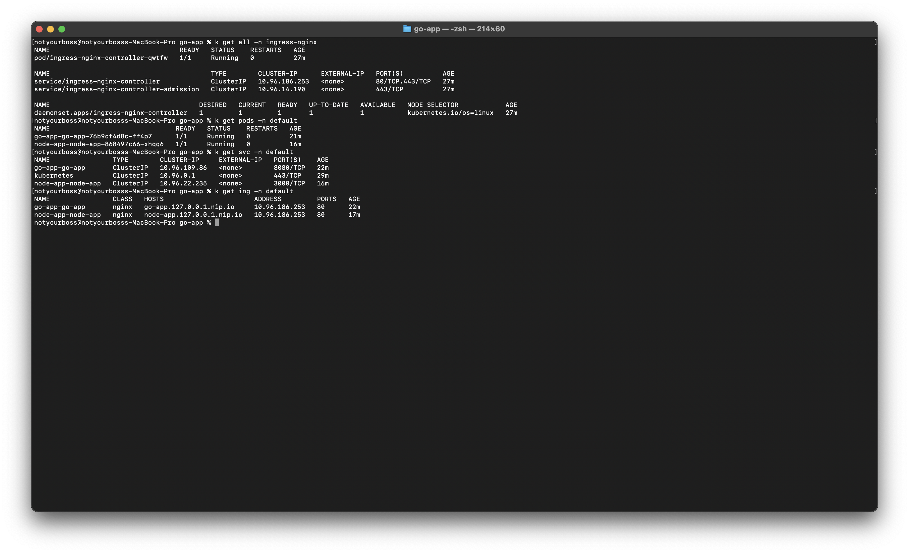
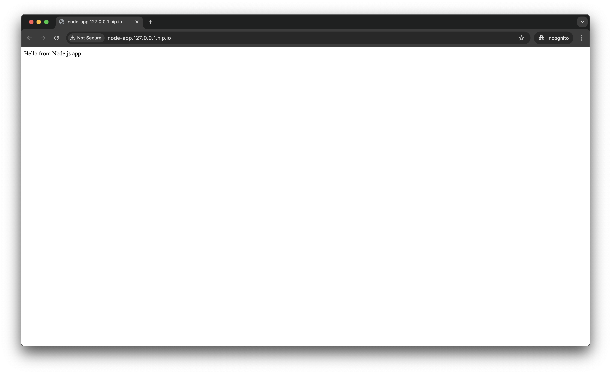
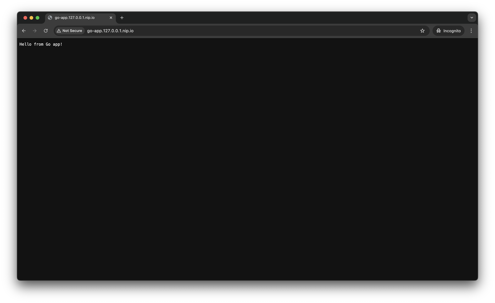

approach to solve this test:
1. First create simple application for nodejs and golang
2. Setup Dockerfile for both app
3. Create github workflow for build and push image into dockerhub
4. Create temporary PAT for secret and then injected into github secret
5. Insert PAT into secret github 
6. If anything sucsess create tag in release and then check the tab action that will be
trigger build image and push into dockerhub (public mode)
7. FYI im using multibuild docker because the k8s running under ARM 
8. Create KIND Cluster in Local 
9. Install Ingress Controller for expose the service
10. Create helm template and change manifest deploymeny, service, ingress and then values.yaml
11. Helm install for both app and then check it via domain 
12. Check all manifest pods, svc and ingress make sure all manifest succesfully running

CI/CD pipeline workflow.

change code in local > push code into main > create semantic tag version > wait for buid and push image > docker pull in local > change image in values.yaml > running command helm upgrade if you want change the value

## Deployment Screenshot

